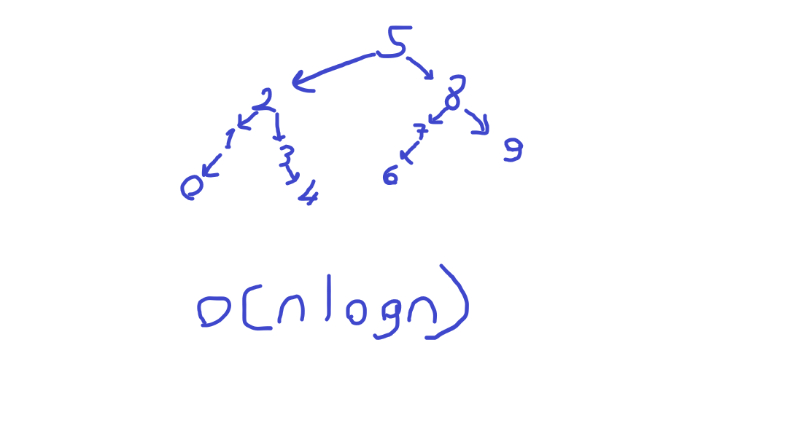

## Proje 3
[7, 5, 1, 8, 3, 6, 0, 9, 4, 2] dizisinin Binary-Search-Tree aşamalarını yazınız.

---

### Root olarak 5 seçilirse çözüm görseldeki gibi olur.

### Time complexity:

* Average case: O (logn)
* Worst case: O (n)